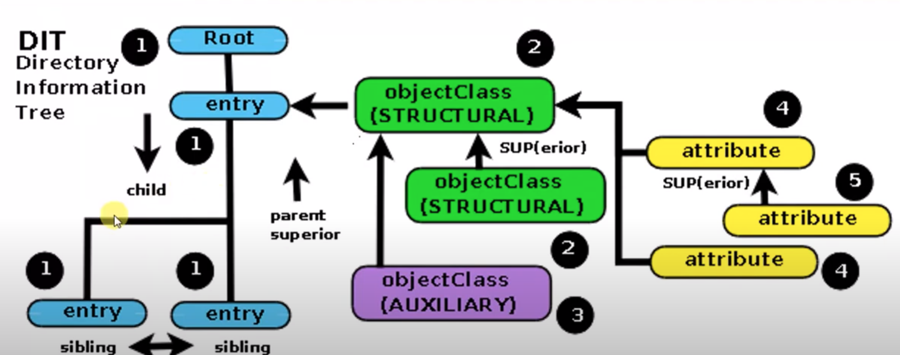
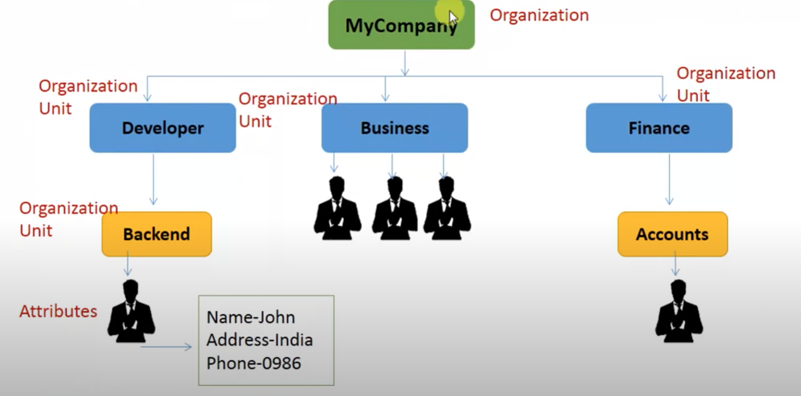

# LDAP 
# what is** **LDAP
Lightweight directory access protocol (LDAP) is a protocol that helps users find data about organizations, persons, and more.

## goals
LDAP has two main goals: to store data in the LDAP directory and authenticate users to access the directory.

# LDAP authentication process
What prompts an LDAP search, and how does it work?

The LDAP authentication process is a client-server model of authentication, and it consists of these key players: 

* **Directory System Agent (DSA):** a server running the LDAP on its network
* **Directory User Agent (DUA):** accesses DSAs as a client (ex. a user’s PC)
* **DN:** the distinguished name, which contains a path through the directory information tree (DIT) for LDAP to navigate through (ex. cn=Susan, ou=users, o=Company)
* **Relative Distinguished Name (RDN):** each component in the path within the DN (ex. cn=Susan)
* **Application Programming Interface**** (API):** lets your product or service communicate with other products and services without having to know how they’re implemented

## version 
  Use LDAPv3.

  With LDAPv3, users will go through one of two possible user authentication methods: simple authentication, like SSO with login credentials, or SASL authentication, which binds the LDAP server to a program like Kerberos. The login attempt sends a request to authenticate the DN assigned to the user. The DN is sent through the client API or service that launches the DSA.

## DIT And his compontents
   LDAP’s lightweight structure and use of a DIT make it possible to quickly run an LDAP search and successfully provide results.

DIT full name is **Directory information tree**. LDAP DITs are often pretty flat, with the vast majority of entries being leaf entries (i.e., entries that do not have any children), and only a relatively small number of non-leaf entries.The DIT starts at the root directory, followed by countries, which then branches out to two subclasses: the Domain Component (dc) and Organization Name (o).

**Domain Access Component  (dc)**

   The dc (i.e. dc=com, dc=example) uses domain name system (DNS) mapping to locate Internet domain names and translate them into IP addresses. 

   Most users don’t know the domain name and/or IP address of the individual they’re searching for. In this case, LDAP uses the Distinguished Name (DN) assigned to the user as a path to quickly navigate through the DIT and find the search result. This is where the o subclass comes in. 

**Organization Name (o)**

   The o subclass (ex. o-Company) is one of the most general subclasses listed in the DN, and it is usually where LDAP starts when it runs a search. For example, a simple path usually starts with the o subclass, branching off to the Organizational Unit (ou), followed by a user account or group. 

**Organizational Unit (ou)**

    As previously mentioned, the ou is a subclass of o and is often seen as ou=users or ou=group, with each containing a list of user accounts or groups. Here’s how this might look in a directory:

* o=MyCompany
* cn=developers
* cn=Backend
* ou=users
* cn=John 

**Common name (cn)**

    A common name, or cn, is used to identify the name of a group or individual user account (ex. cn=developers, cn=Susan). A user can belong to a group, so if Susan is a developer, they could also live under cn=developers. 

**Attributes and values**

    Each subclass in the LDAP DIT (i.e. o, ou, cn) contains attributes and values, or schema that contains information on a LDAP directory’s structure that can help narrow down a search. Attributes are similar to what you would find in an address book entry, with labels like name, phone number, and address, and there are values assigned to each attribute. For example, Susan would be the value of the name attribute.

   In the cn=Susan account, user id (uid) and userPassword are attributes and a user’s login credentials are the values. However, in a group like cn=developers, Susan would have the uniqueMember attribute (ex. uniqueMember=cn-Susan,ou-Users,o-Company). This maps a path to where Susan’s individual user account is located, along with the information LDAP is searching for. A user account is the end of the line in the DIT, and it is where LDAP ultimately extracts the results of the search. 

   There are many other attribute types and syntaxes that can help narrow down a search, including ObjectClasses, like organizationalPerson (structural) or personal (structural). However, the number of attributes on LDAP is limited in order to keep it lightweight and easy to use.

# wikis
[https://www.redhat.com/en/topics/security/what-is-ldap-authentication](https://www.redhat.com/en/topics/security/what-is-ldap-authentication)

[https://docs.oracle.com/cd/E24847\_01/html/E22302/planldap-111111.html](https://docs.oracle.com/cd/E24847_01/html/E22302/planldap-111111.html)

[https://ldap.com/dit-and-the-ldap-root-dse/](https://ldap.com/dit-and-the-ldap-root-dse/)